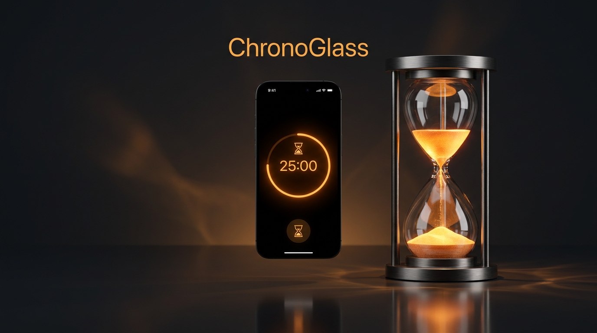

# ⏳ PamoFocus

<div align="center">

<!-- Image de présentation principale / Hero Banner -->


<br/><br/>

[](https://opensource.org/licenses/Apache-2.0)
[](https://developer.android.com)
[](https://kotlinlang.org)
[](https://developer.android.com/jetpack/compose)
[](https://developer.android.com/training/data-storage/room)

**PamoFocus** est une application Android moderne de productivité basée sur la technique Pomodoro, sublimée par un sablier fluide animé en temps réel, un moteur d'ambiances sonores génératives et un suivi analytique approfondi.

</div>

---

## 📸 Aperçu de l'Application

<!-- Emplacement pour vos captures d'écran -->

<div align="center">
  <table>
    <tr>
      <td align="center" width="25%">
        
        <br /><b>Minuteur Sablier</b>
      </td>
      <td align="center" width="25%">
        
        <br /><b>Gestion des Missions</b>
      </td>
      <td align="center" width="25%">
        
        <br /><b>Analyses & Séries</b>
      </td>
      <td align="center" width="25%">
        
        <br /><b>Sons & Réglages</b>
      </td>
    </tr>
  </table>
</div>

> 💡 *Astuce : Déposez vos images dans le dossier `docs/screenshots/` en reprenant les noms `hero_banner.png`, `screenshot_timer.png`, `screenshot_tasks.png`, `screenshot_stats.png`, et `screenshot_settings.png`.*

---

## ✨ Fonctionnalités Principales

- ⏳ **Sablier Fluide & Graphismes Canvas** : Visualisation physique du temps qui s'écoule avec chute de particules de sable, écoulement fluide et lueur ambrée réactive.
- 🎯 **Gestion de Tâches par Sabliers** : Découpage des projets en missions quantifiables (ex: 2 à 4 sabliers de 25 min) avec statut en direct.
- 🎧 **Moteur d'Ambiances Sonores Synthétiques** : Bruits apaisants générés nativement sans connexion internet (Pluie douce, Bruit blanc, Forêt nocturne, Crépitement de feu, Ondes Alpha 432 Hz).
- 📊 **Tableau de Bord Statistique** : Graphique de répartition hebdomadaire, calcul des temps de focus total, taux de complétion et compteur de séries de jours consécutifs (*streaks*).
- 💾 **Persistance 100% Locale (Room Database)** : Vos données et historiques restent strictement privés et sauvegardés sur votre appareil.
- 🎨 **Design Sombre d'Exception (Material 3)** : Palette sombre aux accents ambre et or, contrastes soignés et animations soyeuses.

---

## 🏗️ Architecture & Stack Technique

- **Langage** : Kotlin
- **Interface Utilisateur** : Jetpack Compose & Material 3
- **Architecture** : MVVM (Model - View - ViewModel) + StateFlow réactif
- **Base de Données** : SQLite via Android Room & Kotlin Coroutines Flow
- **Rendu Visuel** : Android Compose `Canvas` & `DrawScope` personnalisé
- **Moteur Audio** : `AudioTrack` natif Android pour la synthèse sonore procédurale temps réel
- **Tests** : JUnit 4, Robolectric & Roborazzi

---

## 🚀 Installation & Lancement

### Prérequis
- **Android Studio** Ladybug (ou version plus récente)
- **JDK** 17+
- **Android SDK** API 24 (Android 7.0) minimum, ciblé API 34+

### Cloner et compiler le projet

```bash
# 1. Cloner le dépôt
git clone https://github.com/votre-compte/PamoFocus.git

# 2. Accéder au répertoire
cd PamoFocus

# 3. Compiler l'APK de débogage
gradle assembleDebug

# 4. Exécuter les tests unitaires
gradle :app:testDebugUnitTest
```

---

## 📜 Licence

Ce projet est distribué sous la licence **Apache 2.0**. Pour plus de détails, consultez le fichier [LICENSE](LICENSE).

```text
Copyright 2026 PamoFocus Contributors

Licensed under the Apache License, Version 2.0 (the "License");
you may not use this file except in compliance with the License.
You may obtain a copy of the License at

    http://www.apache.org/licenses/LICENSE-2.0

Unless required by applicable law or agreed to in writing, software
distributed under the License is distributed on an "AS IS" BASIS,
WITHOUT WARRANTIES OR CONDITIONS OF ANY KIND, either express or implied.
See the License for the specific language governing permissions and
limitations under the License.
```
